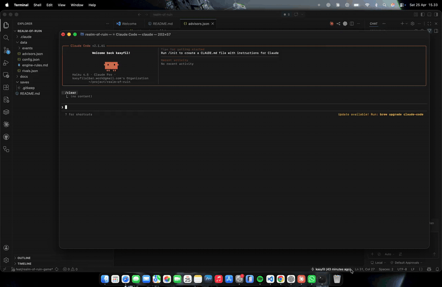

# Realm of Ruin

A dark medieval kingdom management game that runs entirely inside **Claude Code**.

You are a minor lord who inherits a crumbling keep. No tutorial. No hand-holding. Make decisions, face consequences, die or rise to become emperor. Every playthrough is different.



> Prefer video? [Watch the full screen recording (MP4)](assets/demo.mp4).

## Install

Realm of Ruin is a Claude Code plugin. Install it from inside Claude Code:

```
/plugin marketplace add Kasyfil97/realm-of-ruin
/plugin install realm-of-ruin@realm-of-ruin
```

That's it. Both `/realm-of-ruin:new-game` and `/realm-of-ruin:load-game` will be available.

### Requirements

- [Claude Code](https://claude.com/claude-code) with an active subscription
- Python 3 on `PATH` as `python3` or `python` (used for dice rolls and randomization)
- **Windows users:** Claude Code runs the plugin's shell snippets through Git Bash, so install [Git for Windows](https://git-scm.com/download/win) if you don't already have it. macOS and Linux work out of the box.

### Updating

```
/plugin marketplace update realm-of-ruin
```

### Uninstalling

```
/plugin uninstall realm-of-ruin@realm-of-ruin
```

## How to Start

### New Game

```
/realm-of-ruin:new-game
```

A kingdom will be generated for you with a name, a lord title, and randomized starting resources. The game begins immediately — Day 1, no pleasantries.

### Load Game

```
/realm-of-ruin:load-game
```

Lists your saved campaigns. Pick one and continue where you left off.

## How to Play

Each turn is **one day**. Every day, an event is drawn and presented to you as a dilemma. You pick an option. Consequences follow. Repeat until you claim the throne — or die trying.

### The Screen

```
┌──────────────────────────────────────────┐
│  REALM OF RUIN      Day 14/100 │ Act I   │
├──────────────────────────────────────────┤
│  Gold .. 420  │  Loyalty .. 55          │
│  Food .. 580  │  Pop .... 980           │
│  Military  38  │  Rep ..... 28          │
├──────────────────────────────────────────┤
│  EVENT TITLE                             │
│                                          │
│  Narrative description of what's         │
│  happening in your kingdom...            │
├──────────────────────────────────────────┤
│  [1] Option A                            │
│  [2] Option B                            │
│  [3] Option C                            │
└──────────────────────────────────────────┘
```

Pick a numbered option. You can also choose **"Save and quit"** at any time.

### Resources

You manage 6 resources. If **any** hits zero, you lose.

| Resource | What it represents | Death at zero |
|----------|-------------------|---------------|
| Gold | Treasury and wealth | Seized by creditors |
| Food | Grain stores and supplies | Famine revolt |
| Military | Soldiers and defenses | Overrun by enemies |
| Loyalty | Noble support for your rule | Coup by nobles |
| Population | People in your kingdom | Kingdom abandoned |
| Reputation | How the realm sees you | Exiled in disgrace |

Every choice costs something. There are no free wins.

### The Three Acts

| Act | Days | Theme |
|-----|------|-------|
| **Act I: The Inheritance** | 1–30 | Establish your rule. Survive bandits, droughts, and noble scheming. |
| **Act II: The Rivals** | 31–65 | Three rival lords emerge. Fight, ally, or outmaneuver them. |
| **Act III: The Throne** | 66–100 | The endgame. Claim the imperial throne or fall. |

### Combat

When battle comes, you commit resources before the outcome is decided:

- **None** — Commit nothing
- **Light** — Risk 10% of a resource
- **Moderate** — Risk 25%
- **Heavy** — Risk 50%
- **Retreat** — Lose some reputation, keep your army

Win and you recover half your commitment. Lose and it's all gone — plus penalties.

### Victory

Survive to Act III and fulfill one of three paths:

| Path | What you need |
|------|--------------|
| **Military Dominance** | High military, defeat 2+ rival lords, win 3+ battles |
| **Political Alliance** | Ally with 2+ rival lords, gain council support, high reputation |
| **Popular Support** | High reputation, large population, strong loyalty |

If Day 100 passes without meeting any victory condition, the council chooses someone else for the throne.

### Advisors

You start with **Commander Aldus**, a cautious military advisor. As the game progresses, you can recruit up to 3 more:

- **Merchant Elara** — Trade specialist, sees everything as profit and loss
- **Whisper** — Espionage specialist, trusts no one
- **Sage Corwin** — Diplomat, believes in peaceful resolution

Advisors offer their perspective on events — but they have biases, and they're sometimes wrong.

### Rival Lords

Three lords stand between you and the throne:

- **Lord Voss, the Warlord** — Respects only strength
- **Lady Morath, the Schemer** — Rules through whispers and poison
- **Duke Ashford, the Diplomat** — Wields influence like a blade

Each can be defeated, allied with, or dealt with through other means. Your choices shape which victory path opens up.

## Saving

The game saves automatically after every turn. Save files are stored in the `saves/` directory of your current working directory as JSON.

## Modding

All game content lives in JSON files under `data/` inside the plugin directory:

- `config.json` — Resource balance, victory thresholds, act timing
- `events/act1.json`, `act2.json`, `act3.json` — Event pools per act
- `events/special.json` — Transitions, chains, and victory events
- `advisors.json` — Advisor personalities and biases
- `rivals.json` — Rival lord stats and resolution paths

Clone this repo and edit these to create your own events, rebalance resources, or add new content. After editing, re-link the local copy via `/plugin marketplace add /path/to/realm-of-ruin`.

## Plugin Layout

```
realm-of-ruin/
├── .claude-plugin/
│   ├── plugin.json          # Plugin manifest
│   └── marketplace.json     # Marketplace entry
├── skills/
│   ├── new-game/SKILL.md    # /realm-of-ruin:new-game
│   └── load-game/SKILL.md   # /realm-of-ruin:load-game
├── data/                    # Game content (rules, events, advisors, rivals)
└── assets/demo.mp4          # Promo video
```

## License

MIT
