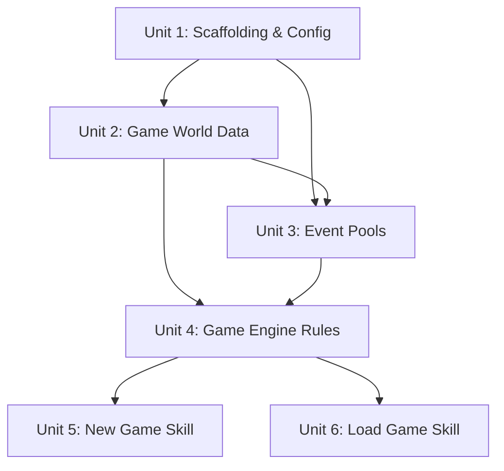

# feat: Build Realm of Ruin TUI Kingdom Game

## Overview

Build a TUI kingdom management game that runs entirely inside Claude Code as a skill/plugin. Claude acts as the game master — reading JSON event templates, narrating dilemmas, tracking state, and rendering a box-drawing panel display. The player is a minor lord inheriting a broken kingdom across a ~100-day campaign with three acts. Two skills provide entry points: `/realm-of-ruin:new-game` and `/realm-of-ruin:load-game`.

## Problem Frame

Players want a replayable, narrative-driven kingdom sim that runs entirely inside Claude Code with no API keys or external dependencies. Claude is the game brain — generating unique narrative from structured templates, tracking consequences, and creating emergent storylines through flag-based branching. Every playthrough should feel different. (see origin: docs/brainstorms/2026-04-25-realm-of-ruin-requirements.md)

## Requirements Trace

- R1-R4: Core game loop — daily turns, weighted event draws, guided improvisation, state persistence
- R5-R8: 6-resource system — Gold, Food, Military, Loyalty, Population, Reputation with zero-death and randomized starts
- R9-R12: Three-act structure with soft window transitions
- R13-R16: Event system — JSON templates, guided improvisation within ranges, flags, chained events
- R17-R19: Risk-commit combat system
- R20-R23: Recruitable specialist advisors (max 4)
- R24-R26: Hybrid panel TUI display
- R27-R29: JSON state persistence with multiple save files
- R30-R32: Claude Code skill integration
- R33-R35: Faction influence victory race
- R36-R38: Three rival lords with multiple resolution paths

## Scope Boundaries

- No graphical UI — TUI box-drawing only via Claude's text output
- No multiplayer, no maps, no tutorial system, no undo/rollback
- No external dependencies or npm packages — pure skill prompts + JSON data
- No test suite — this is a prompt-driven game, not a codebase with executable logic. Validation is through playtesting
- Game balance is iterative — initial values are starting points, not final

## Context & Research

### Claude Code Skill System

- Skills live in `.claude/skills/<skill-name>/SKILL.md` with YAML frontmatter
- Namespaced commands use colon syntax: `name: realm-of-ruin:new-game` invoked as `/realm-of-ruin:new-game`
- `disable-model-invocation: true` + `user-invocable: true` prevents auto-triggering, shows in `/menu`
- `allowed-tools: Read Write Bash Edit Glob` pre-approves tools for seamless gameplay
- Shell injection `!`cat file`` loads data at invocation time into the prompt
- Supporting files in the skill directory or project root can be referenced
- First ~5000 tokens of skill content survive context compression — critical rules must fit within this budget
- `AskUserQuestion` is available for interactive player input during gameplay

### Architectural Decisions from Research

- **Engine rules in SKILL.md directly** — The game engine rules (~2000-3000 tokens) should be embedded in the skill prompt body, not in a separate file. This ensures they survive context compression across a 100-turn game. Event data, advisor data, and rival data are loaded from JSON files per-turn.
- **Randomness via Bash** — Claude has no built-in RNG. Use `Bash: python3 -c "import random; ..." 2>/dev/null || python -c "import random; ..."` for weighted event selection and starting resource randomization. On Windows, `python` may be the correct command instead of `python3`.
- **Save file as source of truth** — Claude reads the save file at the start of each turn and writes it at the end. This ensures state recovery after context compression. The save file contains everything needed to resume.
- **AskUserQuestion for player choices** — Use the blocking question tool for player decisions. This gives structured input and prevents free-text ambiguity.

## Key Technical Decisions

- **Embedded engine rules, external game data:** The SKILL.md contains all game logic (TUI template, turn structure, event selection algorithm, combat resolution, win/loss checks). JSON data files contain content (events, advisors, rivals, config). This splits engine from content cleanly. Rationale: engine rules must survive context compression; content is re-loaded each turn from files.

- **Per-turn file I/O pattern:** Each turn involves ~5-7 tool invocations: read save file, read event file, optionally read advisors.json, Bash for RNG, AskUserQuestion, write save file. Over 100 turns that's 500-700 tool calls, which is acceptable for Claude Code. The full event file is read each turn (accepted context cost for MVP — optimization path is to split into index + detail files if context pressure becomes a problem). Rationale: guarantees state consistency even after context compression.

- **AskUserQuestion with numbered options:** Player choices use AskUserQuestion with 2-4 options per event. Rationale: structured input prevents parsing errors and ensures clean game flow. For combat, resource commitment uses tiered choices ("Commit lightly / Commit moderately / Commit heavily / Hold back") rather than numeric input, since AskUserQuestion supports labeled choices, not free-text numbers. Every AskUserQuestion includes a "Save and quit" option so the player can exit gracefully at any point.

- **Single save file per game, multiple games supported:** Each `/realm-of-ruin:new-game` creates a new save file with timestamp. `/realm-of-ruin:load-game` lists all saves and lets the player choose. Rationale: simpler than auto-save slots, supports multiple concurrent campaigns.

- **Randomness via Python one-liner:** Use `python3 -c "..." 2>/dev/null || python -c "..."` via Bash tool. Rationale: Claude cannot reliably "pretend" to be random; actual RNG produces better gameplay. The fallback handles Windows where `python3` may not be in PATH.

- **Event pool size: 12 per act + 8 special = 44 total:** Minimum viable pool that provides enough variety without massive content creation effort. Each act has 12 dilemma events. Special events cover act transitions (3), victory claim (1), and chain consequences (4). More events can be added later. (see origin R13)

- **Event repeat suppression:** The event selection algorithm excludes event IDs that appear in the last 5 entries of `event_history`. With 12 events per act, this prevents immersion-breaking back-to-back repeats while still allowing events to recur with new narrative. Rationale: 12 events over 30+ days means repeats are inevitable; suppression makes them feel like recurring themes rather than bugs.

- **Day 100 hard cap with forced endgame:** If the player reaches day 100 without meeting any victory condition, a forced defeat event fires: "The council has chosen another." This prevents infinite games, preserves campaign tension, and avoids context window exhaustion. Rationale: the "~100 days" target needs a hard backstop.

- **Victory claim is a narrative epilogue, not a pass/fail gate:** When victory conditions are met, the victory claim event fires. The player's choice determines the flavor of their reign (benevolent, iron-fisted, etc.) but always results in a win. Rationale: the player earned the victory by meeting the conditions; the final choice is about legacy, not a gotcha.

- **Act transition priority:** Act transition events take priority over chain consequence events and normal event draws. If a chain and a transition collide on the same day, the transition fires and the chain is delayed by 1 day. Rationale: act pacing must be preserved; chains are flexible by design.

## Open Questions

### Resolved During Planning

- **Starting resource values:** Gold 500, Food 600, Military 40, Loyalty 60, Population 1000, Reputation 30 with +/-15% variance per playthrough. These create different opening pressures. Food is highest because food consumption is ongoing. Military and Reputation are lowest because they're hardest to rebuild. (resolves origin deferred question on R8)

- **Rival lord identities:** Lord Voss (The Warlord — aggressive, high military, respects strength), Lady Morath (The Schemer — manipulative, espionage-focused, medium military), Duke Ashford (The Diplomat — calculating, low military but high political influence). Each has distinct event triggers and resolution paths. (resolves origin deferred question on R36)

- **Victory path thresholds:** Military Dominance requires Military >= 70 + defeated >= 2 rival lords + battles_won >= 3. Political Alliance requires allied with >= 2 rival lords + council_support >= 2 + Reputation >= 50. Popular Support requires Reputation >= 70 + Population >= 1500 + Loyalty >= 70. (resolves origin deferred question on R33-34)

- **Event template schema:** Defined below in High-Level Technical Design. (resolves origin deferred question on R13)

- **Combat resource commitment format:** AskUserQuestion supports labeled choices, not numeric input. Combat uses tiered commitment levels per resource ("Light / Moderate / Heavy / None") rather than asking for specific numbers. This keeps combat consistent with the rest of the game's input model.

- **Day 100 hard cap:** Games end at day 100 if no victory condition is met. A forced defeat event fires ("The council has chosen another"). This bounds the campaign and prevents context window exhaustion.

- **Quit mechanism:** Every AskUserQuestion includes a "Save and quit" option. The engine rules instruct Claude to save state and end the game loop gracefully when selected.

- **Event repeat suppression:** Events seen in the last 5 days are excluded from the draw pool. Prevents immersion-breaking repetition while allowing events to recur with fresh narrative.

### Deferred to Implementation

- **Exact event narrative content:** Event titles, narrative hooks, and option labels will be written during Unit 3. The schema is defined but content creation is implementation work.
- **Balance tuning:** Resource impact ranges, event weights, and victory thresholds will need adjustment after playtesting. Initial values are educated guesses.
- **Context window pressure at turn 80+:** If the conversation grows too large and compression degrades gameplay, the skill may need a "checkpoint" mechanism where Claude summarizes recent history and starts fresh. Monitor during playtesting.
- **Shell injection path resolution on Windows:** The shell injection `!`cat data/engine-rules.md`` uses a relative path. If the working directory at injection time is the skill directory rather than the repo root, the path will need adjustment (e.g., `../../data/engine-rules.md`). Additionally, the colon in directory names (`realm-of-ruin:new-game`) may cause issues on Windows file systems. Test early; if problematic, rename directories to use dashes or underscores. Fallback if shell injection fails entirely: use Read tool in skill instructions to load `data/engine-rules.md` into context at invocation (preserves single-source, costs slightly more context).

## High-Level Technical Design

> *This illustrates the intended approach and is directional guidance for review, not implementation specification. The implementing agent should treat it as context, not code to reproduce.*

### System Architecture

```
┌─────────────────────────────────────────────────────────┐
│                   CLAUDE CODE SESSION                    │
│                                                         │
│  /realm-of-ruin:new-game          /realm-of-ruin:load   │
│         │                                │              │
│         ▼                                ▼              │
│  ┌─────────────┐                ┌──────────────┐        │
│  │  SKILL.md   │                │  SKILL.md    │        │
│  │  (new-game) │                │  (load-game) │        │
│  │             │                │              │        │
│  │  Contains:  │                │  Contains:   │        │
│  │  - Engine   │                │  - Engine    │        │
│  │    rules    │                │    rules     │        │
│  │  - TUI      │                │  - TUI       │        │
│  │    template │                │    template  │        │
│  │  - Init     │                │  - Load      │        │
│  │    logic    │                │    logic     │        │
│  └──────┬──────┘                └──────┬───────┘        │
│         │                              │                │
│         ▼                              ▼                │
│  ┌──────────────── GAME LOOP ───────────────────┐       │
│  │                                              │       │
│  │  Each turn:                                  │       │
│  │  1. Read saves/<file>.json (current state)   │       │
│  │  2. Check active_chains for today's day      │       │
│  │  3. Read data/events/act{N}.json             │       │
│  │  4. Bash: python3 random → select event      │       │
│  │  5. Read data/advisors.json (if relevant)    │       │
│  │  6. Render TUI panel (text output)           │       │
│  │  7. AskUserQuestion → player choice          │       │
│  │  8. Resolve: apply impacts within ranges     │       │
│  │  9. Check win/loss conditions                │       │
│  │ 10. Write saves/<file>.json (updated state)  │       │
│  │ 11. Loop or end game                         │       │
│  └──────────────────────────────────────────────┘       │
│                        │                                │
│              Reads/Writes from:                         │
│                        │                                │
│         ┌──────────────┼──────────────┐                 │
│         ▼              ▼              ▼                 │
│  ┌────────────┐ ┌────────────┐ ┌──────────────┐        │
│  │ data/      │ │saves/      │ │data/events/  │        │
│  │ config.json│ │save-*.json │ │ act1.json    │        │
│  │ advisors.  │ │ per-save   │ │ act2.json    │        │
│  │ json       │ │ game state │ │ act3.json    │        │
│  │ rivals.json│ │            │ │special.json  │        │
│  └────────────┘ └────────────┘ └──────────────┘        │
└─────────────────────────────────────────────────────────┘
```

### Event Template Schema (Directional)

```
EVENT TEMPLATE:
  id:            string (unique, e.g. "act1_bandit_raid")
  title:         string (display name)
  acts:          number[] (which acts this can appear in)
  weight:        number (selection probability, higher = more likely)
  type:          "dilemma" | "combat" | "advisor" | "chain" | "transition" | "victory"
  preconditions:
    min_day:     number | null
    max_day:     number | null
    required_flags:   string[]
    blocked_by_flags: string[]
    resource_min:     { [resource]: number } (optional thresholds)
  narrative_hooks: string[] (tags for Claude to riff on)
  options:       OPTION[]

OPTION:
  id:            string
  label:         string (short choice text)
  narrative_hint: string (tone/direction for Claude's improvisation)
  impacts:       { [resource]: [min, max] } (ranges Claude picks within)
  flags_set:     string[]
  flags_clear:   string[]
  chain:         { event_id: string, delay_days: [min, max] } | null
```

### Game State Schema (Directional)

```
GAME STATE:
  version:        1
  save_id:        string (timestamp-based)
  kingdom_name:   string
  lord_name:      string
  lord_title:     string
  day:            number
  act:            number (1, 2, or 3)
  resources:      { gold, food, military, loyalty, population, reputation }
  starting_resources: { same shape — for 20% warning threshold calc }
  flags:          string[]
  advisors:       ADVISOR[] (active roster)
  rival_lords:
    lord_voss:    { status, encountered, defeated, allied }
    lady_morath:  { status, encountered, defeated, allied }
    duke_ashford: { status, encountered, defeated, allied }
  event_history:  { day, event_id, choice_id }[] (last 10)
  active_chains:  { trigger_event, trigger_day, trigger_choice_id, consequence_event, scheduled_day }[]
  victory_progress:
    battles_won:    number
    council_support: number
  game_over:      boolean
  game_result:    "victory" | "defeat" | null
```

## Implementation Units



- [ ] **Unit 1: Project Scaffolding & Configuration**

**Goal:** Create the directory structure, config file with starting values, and establish the JSON schemas as reference.

**Requirements:** R5, R8, R28, R33-R34

**Dependencies:** None

**Files:**
- Create: `data/config.json`
- Create: `data/events/` (directory)
- Create: `saves/` (directory with `.gitkeep`)

**Approach:**
- `data/config.json` contains: starting resource base values with variance ranges, act transition windows (Act 1→2: day 25-35, Act 2→3: day 55-70), victory path thresholds, resource warning threshold (20% of starting), max_day (100), event_repeat_cooldown (5), and any global balance knobs.
- The `saves/` directory starts empty with a `.gitkeep`. Save files are created at runtime.
- Do not create a schema file — the schemas in the High-Level Technical Design section above are the reference. The JSON data files in later units are the schema-in-practice.

**Test expectation:** none — pure scaffolding, no behavioral logic.

**Verification:**
- Directory structure exists: `data/`, `data/events/`, `saves/`
- `data/config.json` contains all starting resource values, variance ranges, act windows, and victory thresholds
- Values match the planning decisions: Gold 500 +/-15%, Food 600, Military 40, Loyalty 60, Population 1000, Reputation 30
- Victory path thresholds in config match: Military Dominance (Military >= 70, defeated >= 2 rival lords, battles_won >= 3); Political Alliance (allied >= 2 rival lords, council_support >= 2, Reputation >= 50); Popular Support (Reputation >= 70, Population >= 1500, Loyalty >= 70)

---

- [ ] **Unit 2: Game World Data (Rivals & Advisors)**

**Goal:** Create the rival lord definitions and advisor templates as JSON data files.

**Requirements:** R20-R23, R36-R38

**Dependencies:** Unit 1 (directory structure)

**Files:**
- Create: `data/rivals.json`
- Create: `data/advisors.json`

**Approach:**

Rivals (`data/rivals.json`): Three rival lords, each with:
- Lord Voss — The Warlord: military faction, aggressive stance, high military strength (75), respects strength, triggered by military events. Resolution paths: defeat in battle, or intimidation alliance if player Military > 60.
- Lady Morath — The Schemer: espionage faction, manipulative stance, medium military (45), uses deception, triggered by espionage events. Resolution paths: expose her spy network, counter-espionage alliance, or marriage pact.
- Duke Ashford — The Diplomat: political faction, calculating stance, low military (25) but high political influence, triggered by reputation events. Resolution paths: political alliance, trade agreement, or undermine his council support.

Each rival has: `id`, `name`, `title`, `faction`, `personality`, `military_strength`, `diplomatic_stance`, `resolution_paths` (array describing valid approaches), and `event_triggers` (flags that introduce them).

Advisors (`data/advisors.json`): Four advisor templates:
- Military advisor: specialty "military", personality options (e.g., "aggressive" or "cautious"), bias toward combat solutions. **This is the starting advisor for all new games.**
- Trade advisor: specialty "trade", personality options (e.g., "greedy" or "fair"), bias toward economic solutions
- Espionage advisor: specialty "espionage", personality options (e.g., "paranoid" or "cunning"), bias toward covert solutions
- Diplomacy advisor: specialty "diplomacy", personality options (e.g., "idealistic" or "pragmatic"), bias toward peaceful solutions

Each advisor has: `id`, `name`, `specialty`, `personality`, `bias_description` (how their advice is colored), `recruitment_act` (earliest act they can appear).

**Test expectation:** none — static data files with no behavioral logic.

**Verification:**
- `data/rivals.json` contains 3 rival lords with all required fields
- `data/advisors.json` contains 4 advisor templates covering military, trade, espionage, diplomacy
- Each rival has at least 3 resolution paths
- Advisor recruitment_act values spread across acts (military advisor available Act 1, others Act 1-2)
- Military advisor has a default name (e.g., "Commander Aldus") for use as the starting advisor

---

- [ ] **Unit 3: Event Pools (All Acts + Special Events)**

**Goal:** Create the full event pool — 12 dilemma events per act plus 8 special events (transitions, victory, chains). This is the largest content unit.

**Requirements:** R2, R9-R12, R13-R16, R17, R20, R33-R35, R36-R37

**Dependencies:** Unit 1 (directory structure), Unit 2 (rival/advisor data referenced by events)

**Files:**
- Create: `data/events/act1.json`
- Create: `data/events/act2.json`
- Create: `data/events/act3.json`
- Create: `data/events/special.json`

**Approach:**

All events follow the template schema defined in High-Level Technical Design. Every event must have 2-4 options, each with resource impact ranges. No option should be purely good or purely bad — always a trade-off.

**Act 1 events (12):** Local threats and survival dilemmas. Themes: bandit raids, harvest decisions, noble disputes, merchant dealings, construction choices, peasant petitions, weather crises, tax collection, festival/morale, food spoilage, guard recruitment, neighboring village aid. Include 1 advisor-recruitment event (trade advisor — player already starts with a military advisor). Include 2 events that can chain to future consequences.

**Act 2 events (12):** Regional politics and escalation. Themes: rival lord encounters, espionage opportunities, alliance proposals, marriage offers, trade route control, border skirmishes, spy discovery, advisor recruitment (espionage or diplomacy), resource raids, political maneuvering, mercenary offers, internal betrayal. Include 2-3 combat-type events using the risk-commit system. Include 2 advisor-recruitment events.

**Act 3 events (12):** Power plays and endgame. Themes: council corruption, final confrontations, throne room politics, last-stand defenses, populist movements, noble conspiracies, military campaigns, diplomatic summits, assassination attempts, legacy decisions, rival lord final encounters, people's mandate. Include 3-4 combat events. Events should set flags that contribute to victory paths.

**Special events (8):**
- 3 act transition triggers: Act 1→2 (a rival lord's envoy arrives), Act 2→3 (news of the emperor's death reaches you), forced variants for each if window expires
- 1 victory claim event: fires when any victory path conditions are met. Offers a final dilemma about what kind of emperor the player becomes
- 4 chain consequence events: delayed consequences from earlier choices (bandits return after being paid off, spy reports back, alliance terms come due, betrayed advisor seeks revenge)

Each event's `weight` field controls selection probability. Higher weights for core themes, lower for rare events. Weights within an act should sum to roughly 100 for easy reasoning about probability.

**Test expectation:** none — static data files. Validation is structural: each event has an id, title, acts array, weight, options with impact ranges within the schema.

**Verification:**
- Each act JSON file contains 12 events
- `special.json` contains 8 events (3 transitions, 1 victory, 4 chains)
- Every event has at least 2 options
- Every option has resource impact ranges (not fixed values)
- No option is purely beneficial or purely harmful — each has trade-offs
- Combat events use tiered commitment options ("Light / Moderate / Heavy / None") not numeric input
- Advisor-recruitment events are tagged with `type: "advisor"` and use `blocked_by_flags` (e.g., `"has_trade_advisor"`) to prevent duplicate-specialty recruitment. The recruitment event sets the corresponding flag upon completion.
- Chain events have valid `chain` fields pointing to events in `special.json`
- Event weights within each act sum to roughly 100

---

- [ ] **Unit 4: Game Engine Rules (SKILL.md Core Content)**

**Goal:** Write the complete game engine specification that will be embedded in both skill SKILL.md files. This is the "brain" — the rules Claude follows as game master.

**Requirements:** R1-R4, R6-R7, R12, R14, R17-R19, R24-R26, R27, R33-R35

**Dependencies:** Unit 1 (config schema), Unit 2 (rival/advisor schemas), Unit 3 (event schemas)

**Files:**
- Create: `data/engine-rules.md`

**Approach:**

The engine rules file is a standalone markdown document containing everything Claude needs to run the game. Both SKILL.md files will inject this via shell injection `!`cat data/engine-rules.md``. Target: under 3000 tokens to fit within the 5000-token compression re-attachment budget (leaving room for skill-specific header content).

Sections to include:

1. **Role definition:** "You are the Game Master of Realm of Ruin. You run a TUI kingdom game..."
2. **Turn structure:** Step-by-step turn loop (read state → check for act transition → check chains → select event → render TUI → ask choice with "Save and quit" option → resolve → check win/loss → truncate event_history to last 10 → save state). Spell out exact sequence: After resource updates, (1) Check if any resource == 0 → game over with thematic death. (2) Check if day >= max_day (100) and no victory conditions met → forced defeat. (3) Truncate event_history to last 10 entries. (4) After Act 3 begins, check victory conditions → if met, fire victory claim event next turn. (5) Save state. Do not advance day if "Save and quit" is selected.
3. **TUI template:** Exact box-drawing format for the hybrid panel display. Include the template with placeholders for dynamic values.
4. **Event selection algorithm:** Priority order: (1) act transition events when in transition window, (2) chain consequence events scheduled for today, (3) normal weighted draw from the act's event pool. Filter by preconditions (flags, resource thresholds, day range). Exclude event IDs from the last 5 *entries* of event_history (repeat suppression). With 10-entry history limit, this prevents the last 5 drawn events from recurring immediately. Use Bash `python3 -c "..." 2>/dev/null || python -c "..."` for weighted random selection.
5. **Guided improvisation rules:** Guided improvisation means Claude generates unique narrative and dialogue but cannot apply resource impacts outside the defined range or invent effects not in the template. The narrative is free; the mechanics are rigid. Claude fills in narrative from event's narrative_hooks. Resource impacts must stay within the range defined in the option. Claude should reference the player's advisors when relevant.
6. **Resource update rules:** Apply impacts. Clamp resources to minimum 0. Check if any resource hit 0 → game over with thematic death narrative. After appending to event_history, trim to most recent 10 entries.
7. **Combat resolution:** When a combat event fires, present tiered commitment options per resource ("Light / Moderate / Heavy / None") via AskUserQuestion. Resolve based on commitment level + Military stat + randomness (Bash). Retreat is always an option.
8. **Win/loss checking:** After each resource update, check for zero-death. Check if day >= max_day (100) → forced defeat ("The council has chosen another"). After Act 3 begins, check victory path conditions against config thresholds. If met, fire the victory claim event (narrative epilogue — always a win, choice determines reign flavor).
9. **Act transition logic:** Act transition events take priority over chains and normal draws. Check if current day is within the transition window. If so, fire the transition event. If past the window end, force it immediately. If a chain was scheduled for the same day, delay the chain by 1 day.
10. **State persistence:** After every turn, write the full game state to the save file using the Write tool. Read the save file at the start of every turn (do not rely on conversation memory alone). Validate basic state structure on load (resources exist as numbers, day is positive integer, act is 1-3).
11. **Advisor behavior:** When presenting events, check if any active advisor's specialty matches the event's narrative_hooks. If so, include their biased advice in the narrative. Advisor advice should reflect their personality and sometimes be wrong.
12. **Narrative tone:** No hand-holding. No explicit warnings. Urgency through narrative tone when resources are low. Dark, gritty medieval tone. Consequences feel real.
13. **Quit handling:** When the player selects "Save and quit," save the current state and end the game loop with a brief farewell message. Do not advance the day.
14. **RNG command:** Use `python3 -c "import random; print(random.randint(1, N))" 2>/dev/null || python -c "import random; print(random.randint(1, N))"` to handle both Unix and Windows environments.

**Test expectation:** none — this is a prompt specification, not executable code.

**Verification:**
- Engine rules cover all 14 sections listed above
- TUI template matches the hybrid panel format from the brainstorm (resource dashboard top, narrative middle, choices bottom)
- Event selection algorithm includes chain checking, precondition filtering, and weighted random selection
- Event file paths correctly reference `data/events/act1.json`, `data/events/act2.json`, `data/events/act3.json`, `data/events/special.json` (or clarify if alternative naming like `act1-events.json` is used and ensure consistency across all engine references)
- Rules explicitly state Claude must read/write the save file each turn
- Rules explicitly state Claude must stay within defined impact ranges
- Total token count is under 3000 tokens (verify with rough word count: ~4000 words max)
- Cross-reference check: every field path the engine rules reference exists in the actual JSON data files (e.g., `event.preconditions.required_flags` exists in act1.json, `advisor.specialty` exists in advisors.json, `rival.military_strength` exists in rivals.json)
- Win/loss checking sequence is explicit: zero-death check → max_day check → victory condition check
- RNG command works on the target platform: `python3 -c "import random; print(random.randint(1, 100))" 2>/dev/null || python -c "import random; print(random.randint(1, 100))"`

---

- [ ] **Unit 5: New Game Skill**

**Goal:** Create the `/realm-of-ruin:new-game` Claude Code skill that initializes a new game and starts the game loop.

**Requirements:** R30, R31, R32, R8

**Dependencies:** Unit 4 (engine rules to embed)

**Files:**
- Create: `.claude/skills/realm-of-ruin:new-game/SKILL.md`

**Approach:**

SKILL.md structure:
1. **Frontmatter:** `name: realm-of-ruin:new-game`, `description: Start a new Realm of Ruin campaign`, `disable-model-invocation: true`, `user-invocable: true`, `allowed-tools: Read Write Bash Glob AskUserQuestion`
2. **Initialization instructions:** Tell Claude to:
   - Read `data/config.json` for starting values
   - Use Bash (python3 random) to generate randomized starting resources within variance
   - Generate a kingdom name, lord name, and lord title (Claude improvises these)
   - Create initial game state JSON with day 1, act 1, empty flags, 1 starting advisor (military), no chains, no event history
   - Write state to `saves/save-{timestamp}.json`
   - Display a brief opening narrative (the inheritance scene — you arrive at your crumbling keep)
3. **Engine rules injection:** `!`cat data/engine-rules.md`` — injects the full game engine (test path resolution early; see verification section)
4. **Start game loop:** Tell Claude to begin the daily turn loop starting at Day 1

The opening narrative should set the tone: gritty, no tutorials, the player is thrown into their first dilemma immediately after the scene-setting.

**Test expectation:** none — this is a skill prompt file. Validation is through manual invocation.

**Verification:**
- `.claude/skills/realm-of-ruin:new-game/SKILL.md` exists with correct frontmatter
- Shell injection `!`cat data/engine-rules.md`` is present and correctly formatted
- Initialization logic references `data/config.json` for starting values
- Save file creation targets `saves/save-{timestamp}.json`
- Shell injection path resolves correctly from the skill's working directory. **Test early:** If `data/engine-rules.md` fails, try relative paths like `../../data/engine-rules.md` or use Read tool fallback (embed engine rules directly in SKILL.md instead of via injection if paths prove problematic)
- Colon in directory name (`realm-of-ruin:new-game`) works on Windows file system (if not, rename directory to use dashes/underscores and update `name` field in frontmatter accordingly)
- Military advisor is initialized as the starting advisor with the default name from advisors.json
- Invocation via `/realm-of-ruin:new-game` in Claude Code starts a game session

---

- [ ] **Unit 6: Load Game Skill**

**Goal:** Create the `/realm-of-ruin:load-game` Claude Code skill that lists saves and resumes a game.

**Requirements:** R29, R30, R32

**Dependencies:** Unit 4 (engine rules to embed). Note: Unit 5 and Unit 6 share the same state schema from the plan and can be built in parallel after Unit 4.

**Files:**
- Create: `.claude/skills/realm-of-ruin:load-game/SKILL.md`

**Approach:**

SKILL.md structure:
1. **Frontmatter:** `name: realm-of-ruin:load-game`, `description: Resume a saved Realm of Ruin campaign`, `disable-model-invocation: true`, `user-invocable: true`, `allowed-tools: Read Write Bash Glob AskUserQuestion`
2. **Load instructions:** Tell Claude to:
   - Use Glob to find all `saves/save-*.json` files
   - Read each save file in full, extract kingdom_name, lord_name, day, and act for the selection list (show the 5 most recent; if more exist, note how many are hidden)
   - Present saves to the player via AskUserQuestion (e.g., "Lord Aldric of Thornwall — Day 14, Act I")
   - If no saves exist, tell the player to start a new game with `/realm-of-ruin:new-game`
   - Read the selected save file fully to restore game state
   - Read event files for the current and prior acts to reconstruct narrative context
   - Display a brief "Previously in [kingdom]..." recap using the last 3 event history entries, cross-referencing event templates for narrative details
3. **Engine rules injection:** Same `!`cat data/engine-rules.md`` as the new-game skill (must match exactly for parity)
4. **Resume game loop:** Tell Claude to continue the daily turn loop from the saved day

**Test expectation:** none — this is a skill prompt file. Validation is through manual invocation.

**Verification:**
- `.claude/skills/realm-of-ruin:load-game/SKILL.md` exists with correct frontmatter
- Shell injection matches the new-game skill's engine rules injection (same path and syntax)
- Load logic handles the "no saves found" case gracefully with clear redirect to `/realm-of-ruin:new-game`
- Save selection uses AskUserQuestion with descriptive labels showing lord_name, kingdom_name, day, and act
- Previously recap uses event history to reconstruct narrative context and references event template titles
- Invocation via `/realm-of-ruin:load-game` in Claude Code lists saves and resumes

## System-Wide Impact

- **Interaction graph:** The two skills share the same engine rules via shell injection of `data/engine-rules.md`. Changes to engine rules automatically propagate to both skills. Event files, advisor data, and rival data are read by the engine at runtime. Event pool data files reference rival IDs and advisor IDs from `data/rivals.json` and `data/advisors.json` — changes to those identifiers require updating matching event preconditions.
- **Error propagation:** If a save file is corrupted or malformed, the engine rules instruct Claude to validate basic structure (resources as numbers, day as positive integer, act 1-3). On validation failure, display an error and return to save selection or suggest `/realm-of-ruin:new-game`.
- **State lifecycle risks:** The primary risk is context window pressure over 100 turns. The per-turn read/write pattern to the save file mitigates this. Event history is capped at 10 entries (explicitly truncated each turn). The `active_chains` array is bounded by the number of chain-triggering events (~4). Day 100 hard cap prevents unbounded games.
- **Event collision handling:** Act transitions take priority over chains; chains take priority over normal draws. If a transition preempts a chain, the chain is delayed by 1 day. Event repeat suppression excludes the last 5 event IDs from the draw pool.
- **API surface parity:** Both skills must embed identical engine rules. If `data/engine-rules.md` changes, both skills automatically pick up the change via shell injection.
- **Cross-file validation:** Engine rules reference specific field paths in JSON data files (e.g., `event.preconditions.required_flags`, `advisor.specialty`, `rival.military_strength`). No automated validation exists — field name consistency between engine rules and data files must be manually verified during implementation.
- **Unchanged invariants:** The Claude Code skill system, file system, and Bash tool are used as-is. No modifications to Claude Code internals.

## Risks & Dependencies

| Risk | Mitigation |
|------|------------|
| Context window pressure over 100 turns | Per-turn save file read/write ensures state recovery. Event history limited to last 10 entries. If compression degrades quality, consider a "checkpoint and summarize" mechanism in a future iteration. |
| Event pool feels repetitive with only 12 per act | 12 per act is the minimum viable pool. Claude's guided improvisation adds narrative variety. Expanding to 20+ per act is straightforward (add more JSON entries). |
| Game balance is off (too easy/too hard) | Config.json centralizes all balance values. Iterative tuning after playtesting. Resource impact ranges in events provide a buffer. |
| Claude doesn't follow engine rules consistently | Engine rules are explicit and imperative. The per-turn save read forces state grounding. If Claude drifts, the save file corrects it next turn. |
| Shell injection `!`cat`` may not work on Windows | Test early. Fallback: use Read tool in skill instructions to load `data/engine-rules.md` into context at invocation (preserves single-source architecture). Also verify colon in directory names works on Windows NTFS. |
| Day 100+ games exhaust context window | Hard cap at day 100 with forced defeat event. Prevents infinite games. |
| Player cannot quit gracefully | Every AskUserQuestion includes "Save and quit" option. Engine rules handle quit by saving state and ending loop. |
| Repeated events break immersion | Event IDs from last 5 event_history entries excluded from draw pool. |
| Field name mismatch between engine rules and JSON data | Manual cross-reference verification in Unit 4. Engine rules reference exact field paths from data files. |
| AskUserQuestion may not support enough options for all events | Events are designed with 2-4 options. AskUserQuestion supports 2-4 options natively. Events requiring more options should be redesigned. |
| Randomness quality from python3 one-liner | Python's `random` module is adequate for game purposes. Seed is not controlled, providing natural variety. |

## Sources & References

- **Origin document:** [docs/brainstorms/2026-04-25-realm-of-ruin-requirements.md](docs/brainstorms/2026-04-25-realm-of-ruin-requirements.md)
- Claude Code skill system: SKILL.md format, frontmatter fields, shell injection, allowed-tools, context compression behavior
